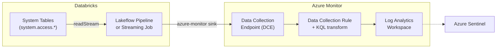

# Databricks System Tables to Azure Monitor

> [!WARNING]
> **Experimental** — Work in progress.

This project streams [Databricks System Tables](https://learn.microsoft.com/en-us/azure/databricks/admin/system-tables/) to [Azure Monitor](https://learn.microsoft.com/en-us/azure/azure-monitor/) / Azure Sentinel, extending beyond what the native [Diagnostic log delivery](https://learn.microsoft.com/en-us/azure/databricks/admin/account-settings/audit-log-delivery) supports.

Databricks has 26 System Tables covering Unity Catalog, Delta Sharing, networking, and more. The native Diagnostic log delivery solution exports only **1 table** — Audit events, at workspace level only.

This project fills that gap by incrementally streaming any System Table to a custom table in a Log Analytics workspace using the [Logs Ingestion API](https://learn.microsoft.com/en-us/azure/azure-monitor/logs/logs-ingestion-api-overview), via a custom PySpark data source running on a Lakeflow Declarative Pipeline or a Structured Streaming job.

**Primary use case:** Cybersecurity teams monitoring network traffic in Azure Sentinel. Serverless compute introduces a new network boundary that doesn't appear in classic diagnostic logs. Forwarding `system.access.outbound_network` to Sentinel gives security teams a unified view across Classic and Serverless Databricks environments.

> [!NOTE]
> For most observability use cases, we recommend analyzing System Tables directly within Databricks. Exporting to Azure Monitor adds synchronization overhead and cost. Consider this solution when your security or operations team requires the data in a centralized Azure tool.


## Architecture



The pipeline registers a custom `azure-monitor` PySpark data source ([`spark.py`](src/sentinel_helpers/spark.py)) that batches rows and uploads them to the DCE via the Logs Ingestion REST API. The DCR applies a KQL transform (adding `TimeIngested`) and routes data to the target Log Analytics table.


## Prerequisites

- Databricks workspace (validated on Azure Databricks, but this should work on AWS and GCP, too)
- **Unity Catalog** enabled on your Databricks account
- **System Tables** enabled (contact your Databricks account team if not available)
- An Azure subscription with permissions to create Log Analytics, DCE, and DCR resources


## Setup

This section will guide you through the setup of the Azure and Databricks resources to successfully deploy and run the solution.

### Unity Catalog

To read data from system tables, you need at least the following permissions:
- `USE CATALOG` on the `system` catalog
- `USE SCHEMA` on the table schema (e.g. `system.access`)
- `SELECT` on the table

> [!TIP]
> If you want to use the Structured Streaming job version of the solution, you also need to create or provide an existing UC Volume for checkpoints.

### Azure Resources

Before you run the project, you need to provision:

* an Entra ID Service Principal, and store its client secret in a Databricks secret scope
* a Log Analytics Workspace

You also need the following roles assigned to the service principal:
* **Log Analytics Contributor** and **Monitoring Contributor** — to create tables, Data Collection Endpoints (DCE), and Data Collection Rules (DCR)
* **Monitoring Metrics Publisher** — to publish logs to the DCEs

You can use a single service principal or two separate ones: one for the initial setup and one for ongoing log publishing.

### Project Environment

The project contains a Databricks Asset Bundle. You can deploy it directly from the Databricks workspace UI or from your local machine.

#### Databricks Workspace

1. Create a [Git Folder](https://learn.microsoft.com/en-us/azure/databricks/repos/), cloning this repo.

1. Adjust configuration in the [`databricks.yml`](databricks.yml) file (see the [Configuration](#configuration) section).

1. Open a terminal in the workspace, then deploy the bundle:
    ```sh
    databricks bundle deploy
    ```

1. Run the `Azure Monitor Setup` job:
    ```sh
    databricks bundle run azure_monitor_setup
    ```

1. Start the `System Tables to Azure Monitor` pipeline (recommended) or job:
    ```sh
    # pipeline - recommended
    databricks bundle run system_tables_to_azure_monitor_pipeline
    # job
    databricks bundle run system_table_to_azure_monitor_job
    ```

#### Local Development

1. Install the latest version of the [Databricks CLI](https://docs.databricks.com/dev-tools/cli/databricks-cli.html).

2. Install [`uv`](https://docs.astral.sh/uv/getting-started/installation/).

3. Authenticate to your Databricks workspace and assign a profile name:
    ```sh
    databricks auth login --host <your-workspace-url>
    ```

4. Set the `DATABRICKS_CONFIG_PROFILE` environment variable:
    ```sh
    export DATABRICKS_CONFIG_PROFILE=<your-profile-name>
    ```

5. Adjust configuration in the [`databricks.yml`](databricks.yml) file (see the [Configuration](#configuration) section).

6. Deploy the bundle:
    ```sh
    databricks bundle deploy
    ```

7. Run the `Azure Monitor Setup` job:
    ```sh
    databricks bundle run azure_monitor_setup
    ```

8. Start the `System Tables to Azure Monitor` pipeline (recommended) or job:
    ```sh
    # pipeline - recommended
    databricks bundle run system_tables_to_azure_monitor_pipeline
    # job
    databricks bundle run system_table_to_azure_monitor_job
    ```


## Configuration

You can adjust the configuration in the [`databricks.yml`](databricks.yml) file.

The following variables apply to all jobs:
* `azure_tenant_id`: the tenant ID of the Service Principal.
* `sp_client_id`: the Service Principal ID.
* `sp_client_secret_scope`: the name of the secret scope containing the Service Principal client secret.
* `sp_client_secret_key`: the name of the secret key containing the Service Principal client secret.
* `subscription_id`: the ID of the subscription containing all the resources (Log Analytics workspace, DCEs and DCRs).
* `resource_group_name`: the name of the resource group containing the DCEs and DCRs.
* `audit_log_table_name`: the name of the table for audit logs in the Log Analytics workspace, defaults to `AdbSystemAccessAudit`.
* `outbound_network_table_name`: the name of the table for outbound network logs in the Log Analytics workspace, defaults to `AdbSystemAccessOutboundNetwork`.

The following variables apply to the setup job only:
* `log_analytics_resource_group_name`: the name of the resource group containing the Log Analytics workspace.
* `log_analytics_workspace_name`: the name of the Log Analytics workspace hosting the tables.
* `location`: the location where DCEs and DCRs are created.

The following variables apply to both the job and the pipeline:
* `starting_datetime`: the datetime for filtering events, e.g. `2025-08-11` or `2025-08-11T00:00:00`.
* `include_workspace_ids`: a JSON string containing the list of workspace IDs to include, e.g. `'["123456789"]'`.
* `exclude_workspace_ids`: a JSON string containing the list of workspace IDs to exclude, e.g. `'["123456789"]'`.

The following variables apply to the pipeline only:
* `pipeline_continuous_mode`: if `true`, the pipeline runs continuously. Defaults to `false`, i.e. the pipeline processes all available records and then stops.
* `pipeline_processing_time`: if specified, overrides the default trigger interval. Applicable only in continuous mode.
* `catalog_name`: the pipeline's catalog name.
* `schema_name`: the pipeline's schema name.

The following variable applies to the job only:
* `checkpoint_root_location`: the checkpoint location for the Structured Streaming checkpoints — a path to a Unity Catalog volume.


## Supported Tables

| Table | Full Name | Setup notebook |
| --- | --- | --- |
| Audit Logs | `system.access.audit` | [audit_setup](src/audit_setup.ipynb) |
| Serverless Egress Control Logs | `system.access.outbound_network` | [network_setup](src/network_setup.ipynb) |


## Costs

Benchmarks collected running the pipeline on serverless compute (East US 2, against `system.access.audit`):

| Mode | # Events | DBUs | List Cost (USD) | Ingestion Rate |
| --- | --- | --- | --- | --- |
| Triggered | 43M | 2 | $1.00 | 11M rows/min, 12k requests/min |
| Continuous | 800k/h | 5/h | $2.30/h | 200k rows/min, 200 requests/min |

> DBU costs only. Azure Monitor ingestion charges apply separately — see [Azure Monitor pricing](https://azure.microsoft.com/en-us/pricing/details/monitor/).


## Roadmap

- [ ] Use environments instead of installing the wheel explicitly


## License

This project is licensed under the [Databricks License](LICENSE).


## Authors

* Sergio Schena - [sergio.schena@databricks.com](mailto:sergio.schena@databricks.com)
* Mattia Zeni - [mattia.zeni@databricks.com](mailto:mattia.zeni@databricks.com)


## Credits

Thanks to **Alex Ott** ([alexey.ott@databricks.com](mailto:alexey.ott@databricks.com)) for inspiring the use of a custom PySpark data source instead of `foreachBatch`:
* [Cyber Spark Data Connectors](https://github.com/alexott/cyber-spark-data-connectors/blob/main/cyber_connectors/MsSentinel.py)
* [Cybersecurity Playground](https://github.com/alexott/databricks-cybersecurity-playground/blob/main/dlt_modern_stuff/src/detections.py)
